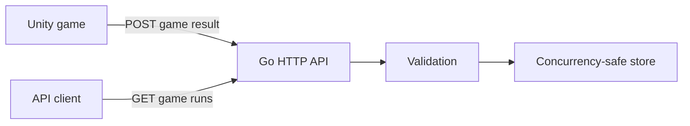

# Skill Survivor Stats Service

[](https://github.com/alexluo-netizen/skill-survivor-stats-service/actions/workflows/ci.yml)

A Go backend service that receives and exposes game-run results from the Unity game [Skill Survivor](https://github.com/alexluo-netizen/Skill-Survivor) through a REST-style JSON API.

The project is a backend and cloud engineering exercise built around a real game client. When a player reaches victory or game over, Unity sends the completed run to this service. The service validates the request, stores it safely, and makes recorded runs available through an HTTP endpoint.

## Current Features

- Health-check endpoint
- Create and list game runs
- JSON request validation and consistent JSON errors
- Concurrency-safe in-memory storage using `sync.RWMutex`
- Unity integration through `UnityWebRequest`
- HTTP handler tests using `httptest`
- Automated formatting, vetting, race detection, testing, and building with GitHub Actions
- Local-only server binding for safe development

## Architecture



Current request flow:

```text
Unity game ends
    -> GameStatsUploader serializes the result as JSON
    -> POST /api/v1/game-runs
    -> Go decodes and validates the request
    -> GameRunStore assigns an ID and stores the run
    -> API returns HTTP 201 with the created record
```

## Technology

- Go standard library: `net/http`, `encoding/json`, `log/slog`
- Concurrency: `sync.RWMutex`
- Testing: `testing`, `net/http/httptest`
- CI: GitHub Actions on Ubuntu
- Client integration: Unity and C# `UnityWebRequest`

The current version intentionally avoids a large web framework so that routing, handlers, HTTP semantics, validation, concurrency, and error handling remain explicit.

## API

| Method | Path | Description | Success |
| --- | --- | --- | --- |
| `GET` | `/healthz` | Check whether the service is responding | `200 OK` |
| `POST` | `/api/v1/game-runs` | Validate and create a game run | `201 Created` |
| `GET` | `/api/v1/game-runs` | List all game runs | `200 OK` |

### Game-run representation

```json
{
  "id": "1",
  "player_id": "local-player",
  "survival_seconds": 180,
  "level": 4,
  "normal_kills": 12,
  "fast_kills": 5,
  "tank_kills": 2,
  "result": "completed"
}
```

`result` must be either `completed` or `defeated`. The service also validates the player ID, survival time, and level before storing a run.

## Run Locally

Requirements:

- Go installed
- PowerShell, another terminal, or an HTTP client

Start the API from the repository root:

```bash
go run ./cmd/api
```

The development server listens on:

```text
http://127.0.0.1:8080
```

Check its health:

```bash
curl -i http://127.0.0.1:8080/healthz
```

Expected response:

```http
HTTP/1.1 200 OK
Content-Type: application/json

{"status":"ok"}
```

## Create a Game Run

Example request:

```bash
curl -i -X POST http://127.0.0.1:8080/api/v1/game-runs \
  -H "Content-Type: application/json" \
  -d '{
    "player_id": "local-player",
    "survival_seconds": 185,
    "level": 4,
    "normal_kills": 12,
    "fast_kills": 5,
    "tank_kills": 2,
    "result": "completed"
  }'
```

On Windows PowerShell, use Invoke-WebRequest or place the curl command on one line.

The API returns `201 Created` with the stored record and its assigned ID.

## List Game Runs

```bash
curl -i http://127.0.0.1:8080/api/v1/game-runs
```

The response is a JSON array. An empty store returns:

```json
[]
```

## Unity Integration

The Unity project contains a `GameStatsUploader` component. `GameOverUI` listens for the `GameSession.GameEnded` event and submits these values when a run ends:

- survival time
- player level
- normal, fast, and tank enemy kills
- victory or defeat result

For local testing:

1. Start the Go service.
2. Open Skill Survivor in Unity.
3. Enter Play Mode and finish a run.
4. Confirm the successful upload in the Unity Console.
5. Call `GET /api/v1/game-runs` to inspect the recorded result.

The `127.0.0.1` address works when Unity and the Go service run on the same computer. A distributed build will require a deployed HTTPS API address. A WebGL client will also require an appropriate CORS policy.

## Tests and Quality Checks

Run locally:

```bash
go fmt ./...
go vet ./...
go test ./... -v
go build ./...
```

The GitHub Actions workflow runs on pushes and pull requests to `main`. It checks formatting and executes:

```bash
go vet ./...
go test -race ./...
go build ./...
```

## Current Limitations

- Game runs are stored in process memory and disappear when the service restarts.
- Generated numeric IDs restart from `1` with each process.
- The API has no authentication or authorization yet.
- List responses do not yet support pagination or filtering.
- The service currently binds only to localhost and is not deployed.

These constraints keep the first version small enough to test the HTTP and Unity integration before introducing infrastructure.

## Roadmap

- Replace the in-memory store with PostgreSQL
- Add SQL migrations and database constraints
- Add a client-generated session ID for idempotent uploads
- Add player statistics and leaderboard endpoints
- Add request logging middleware and request IDs
- Add timeouts and graceful shutdown with `context.Context`
- Add Docker and Docker Compose for local development
- Deploy the service behind HTTPS
- Add CORS configuration for a WebGL client

## Engineering Topics Demonstrated

- REST-style API design and HTTP status codes
- JSON encoding and decoding
- Input validation and error handling
- Pointer receivers and interfaces
- Concurrent request handling and mutex-protected state
- Defensive copying of slices
- Automated tests and continuous integration
- Integration between a Unity client and a Go backend
